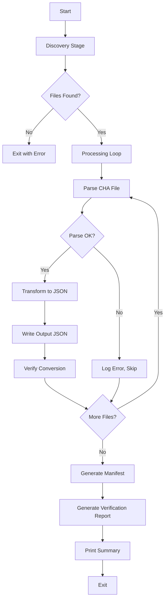

# Design Document: CHA-to-JSON Pipeline

## Overview

This design describes a single Python script (`preprocess_transcripts.py`) that converts CHAT-format (.cha) transcription files from TalkBank's ClassBank dataset into a standardized JSON format. The pipeline operates in five sequential stages: discovery, parsing, transformation, verification, and reporting.

The script processes 21 corpus subdirectories within `dataset/transcripts/`, producing per-file JSON output in `dataset/parsed/{corpus}/`, along with a `manifest.json` index and `verification.json` quality report.

### Design Decisions

1. **Single-script architecture**: All logic resides in `preprocess_transcripts.py` to minimize project footprint and keep the tool self-contained.
2. **pylangacq for parsing**: Leverages the existing `pylangacq` dependency rather than implementing custom CHAT parsing. Uses `strict=False` to tolerate morphology/word misalignment common in ClassBank data.
3. **Regex-based text cleaning**: CHAT annotations follow predictable patterns; a chain of regex substitutions is more maintainable than a full parser for annotation removal.
4. **Per-file verification**: Each conversion is verified independently, allowing partial success across the dataset and clear identification of problem files.
5. **Fail-fast on missing input**: If `dataset/transcripts/` is missing or empty, the script exits immediately rather than producing empty output.

## Architecture



### Stage Responsibilities

| Stage | Input | Output | Error Handling |
|-------|-------|--------|----------------|
| Discovery | `dataset/transcripts/` | List of (corpus, file_path) tuples | Exit if dir missing or no .cha files |
| Parsing | Single .cha file path | Pylangacq Reader object | Log + skip on exception |
| Transformation | Reader + utterances | Target JSON dict | Skip empty-utterance files |
| Verification | Source reader + output JSON | Per-file checks dict | Always produces result |
| Reporting | All results | manifest.json + verification.json | N/A |

## Components and Interfaces

### Module Structure

The script is organized as functions within a single module:

```python
# preprocess_transcripts.py

# --- Discovery ---
def discover_cha_files(base_dir: str) -> list[tuple[str, Path]]
    """Returns list of (corpus_name, file_path) tuples."""

# --- Parsing ---
def parse_cha_file(file_path: Path) -> Optional[pylangacq.Reader]
    """Parses a .cha file, returns Reader or None on failure."""

def extract_participants(reader: pylangacq.Reader) -> dict[str, str]
    """Maps speaker codes to lowercase roles from @Participants header."""

# --- Transformation ---
def clean_utterance_text(raw_text: str) -> str
    """Removes CHAT annotations, returns cleaned plain text."""

def convert_time_marks(time_marks: Optional[tuple[int, int]]) -> tuple[Optional[float], Optional[float]]
    """Converts ms timestamps to seconds rounded to 3 decimal places."""

def generate_session_id(corpus: str, filename: str, file_path: Path) -> str
    """Generates unique session ID from corpus, filename, and path hash."""

def transform_file(reader: pylangacq.Reader, corpus: str, file_path: Path) -> Optional[dict]
    """Transforms parsed CHA data into target JSON schema."""

# --- Verification ---
def verify_conversion(reader: pylangacq.Reader, output: dict, source_path: Path) -> dict
    """Runs all verification checks, returns checks dict with status."""

def classify_verification(checks: dict) -> tuple[str, list[str]]
    """Returns (status, reasons) based on check results."""

# --- Reporting ---
def generate_manifest(results: list[dict]) -> dict
    """Builds manifest.json structure from successful conversions."""

def generate_verification_report(results: list[dict]) -> dict
    """Builds verification.json structure from all results."""

# --- Main ---
def main() -> int
    """Entry point. Returns exit code."""
```

### Function Interfaces

#### `discover_cha_files(base_dir: str) -> list[tuple[str, Path]]`

- Walks `base_dir` recursively using `pathlib.Path.rglob("*.cha")`
- Groups files by immediate parent directory name (corpus)
- Exits with code 1 if `base_dir` doesn't exist or yields no .cha files
- Prints per-corpus counts to stdout

#### `clean_utterance_text(raw_text: str) -> str`

Applies regex substitutions in this order:
1. Remove inline timestamps: `\u0015\d+_\d+\u0015`
2. Remove stress/syllable markers: `\u0001` and `\u0002` (preserving surrounded text)
3. Remove pause markers: `\(\.\)` and `\(\d+\.\d+\)`
4. Remove terminator codes: `\+/\.`, `\+//?`, `\+\.\.\.`, `\+//\.`
5. Remove elongation colons: colons between alphabetic characters or trailing after alphabetic
6. Remove incomplete-word parentheses: `(\w)\((\w)\)` → `\1\2`
7. Collapse whitespace and trim

#### `transform_file(reader, corpus, file_path) -> Optional[dict]`

Returns `None` if no valid segments remain after cleaning. Otherwise returns:
```python
{
    "metadata": {
        "session_id": str,
        "duration_seconds": float,
        "language": str,
        "model": "cha_parser_v1",
        "created_at": str,  # ISO 8601 UTC
        "source": str,      # relative path from project root
        "corpus": str
    },
    "segments": [
        {"start": float|None, "end": float|None, "speaker": str, "text": str}
    ],
    "full_text": str
}
```

#### `verify_conversion(reader, output, source_path) -> dict`

Returns:
```python
{
    "source": str,
    "output": str,
    "corpus": str,
    "status": "pass" | "warn" | "fail",
    "checks": {
        "utterance_count": {"source": int, "output": int, "diff": int},
        "speaker_mapping": {"expected": list, "found": list, "missing": list},
        "timestamp_coverage": {"percentage": float},
        "word_count": {"source": int, "output": int, "diff_percent": float},
        "timestamp_validity": {"violations": list},
        "timestamp_order": {"monotonic": bool}
    },
    "reasons": list[str]  # present when status != "pass"
}
```

## Data Models

### Input: CHAT File Structure (via pylangacq)

```python
# pylangacq Reader API (as used in this pipeline)
reader = pylangacq.read_chat(file_path, strict=False)

reader.file_paths         # list[str]
reader.languages()        # list[str], e.g. ["eng"]
reader.participants()     # set[Participant(code, name, role)]
reader.headers()          # list[Headers(...)]
reader.utterances()       # generator of Utterance objects

# Utterance object
utterance.participant     # str, e.g. "TEA"
utterance.tiers           # dict[str, str], e.g. {"TEA": "...", "%mor": "..."}
utterance.time_marks      # tuple[int, int] | None, milliseconds
utterance.tokens          # list[Token]
```

### Output: Target JSON Schema

```json
{
  "metadata": {
    "session_id": "roth-roth-a1b2c3d4",
    "duration_seconds": 1234.567,
    "language": "en",
    "model": "cha_parser_v1",
    "created_at": "2024-01-15T10:30:00Z",
    "source": "dataset/transcripts/Roth/roth.cha",
    "corpus": "Roth"
  },
  "segments": [
    {
      "start": 0.0,
      "end": 3.361,
      "speaker": "teacher",
      "text": "this is the photograph of of ah the Saanich Peninsula"
    }
  ],
  "full_text": "this is the photograph of of ah the Saanich Peninsula and basically..."
}
```

### Internal Data Structures

```python
# Discovery result
DiscoveredFile = tuple[str, Path]  # (corpus_name, file_path)

# Processing result (accumulated per file)
@dataclass
class FileResult:
    corpus: str
    source_path: Path
    output_path: Optional[Path]
    success: bool
    segment_count: int
    duration: float
    verification: Optional[dict]
```

### ISO 639-3 to ISO 639-1 Language Mapping

A subset relevant to ClassBank corpora:

```python
LANGUAGE_MAP = {
    "eng": "en",
    "spa": "es",
    "fra": "fr",
    "deu": "de",
    "zho": "zh",
    "jpn": "ja",
    "kor": "ko",
}
```

### Manifest JSON Schema

```json
{
  "created_at": "2024-01-15T10:35:00Z",
  "total_files": 150,
  "corpora": {
    "Roth": {
      "files": ["dataset/parsed/Roth/roth.json"],
      "total_segments": 245,
      "total_duration_sec": 1234.567
    }
  }
}
```

### Verification JSON Schema

```json
{
  "run_at": "2024-01-15T10:35:00Z",
  "summary": {
    "total_files": 150,
    "passed": 140,
    "warnings": 8,
    "failed": 2
  },
  "files": [
    {
      "source": "dataset/transcripts/Roth/roth.cha",
      "output": "dataset/parsed/Roth/roth.json",
      "corpus": "Roth",
      "status": "pass",
      "checks": { "..." : "..." }
    }
  ]
}
```

## Correctness Properties

*A property is a characteristic or behavior that should hold true across all valid executions of a system—essentially, a formal statement about what the system should do. Properties serve as the bridge between human-readable specifications and machine-verifiable correctness guarantees.*

### Property 1: Corpus grouping matches parent directory

*For any* file path within `dataset/transcripts/`, the corpus identifier assigned by the discovery function SHALL equal the name of the file's immediate parent directory.

**Validates: Requirements 1.2**

### Property 2: Speaker role resolution

*For any* participant entry with a speaker code and role from the @Participants header, the pipeline SHALL produce a lowercase version of that role as the speaker value. *For any* speaker code with no defined role, the pipeline SHALL use the speaker code converted to lowercase.

**Validates: Requirements 3.1, 3.2, 3.3, 3.4**

### Property 3: Timestamp conversion preserves value

*For any* non-negative integer millisecond value, converting to seconds SHALL produce a float equal to the original value divided by 1000.0, rounded to exactly three decimal places. *For any* None time marks input, both start and end SHALL be null.

**Validates: Requirements 4.1, 4.2, 4.3, 4.4, 4.5**

### Property 4: Text cleaning is idempotent

*For any* string, applying the text cleaning function twice SHALL produce the same result as applying it once (i.e., `clean(clean(x)) == clean(x)`).

**Validates: Requirements 5.2, 5.3, 5.4, 5.5, 5.6, 5.7, 5.8**

### Property 5: Cleaned text contains no CHAT annotation patterns

*For any* input string, the cleaned output SHALL NOT contain any pause markers `(.)` or `(N.N)`, terminator codes `+/.` `+//?` `+...` `+//.`, inline timestamp markers (U+0015 delimited), stress/syllable control characters (U+0001, U+0002), or elongation colons between alphabetic characters.

**Validates: Requirements 5.2, 5.3, 5.4, 5.5, 5.6**

### Property 6: Segments are ordered by start timestamp with nulls last

*For any* output segments array, all segments with non-null start values SHALL appear in non-decreasing order of start, and all segments with null start values SHALL appear after all non-null-start segments.

**Validates: Requirements 6.6**

### Property 7: Full text equals space-joined segment texts

*For any* valid output JSON, the `full_text` field SHALL equal the concatenation of all segment `text` values from the `segments` array, joined by a single space character.

**Validates: Requirements 6.7**

### Property 8: Session ID is deterministic and correctly formatted

*For any* given corpus name, filename, and absolute file path, the generated `session_id` SHALL always produce the same value, and SHALL match the format `{lowercase_corpus}-{lowercase_filename}-{first_8_chars_of_sha256_hex}`.

**Validates: Requirements 6.2**

### Property 9: Duration equals maximum end timestamp

*For any* set of segments, `duration_seconds` SHALL equal the maximum non-null `end` value across all segments, rounded to three decimal places. If no segments have a non-null end, duration SHALL be 0.0.

**Validates: Requirements 6.3**

### Property 10: Verification classification is consistent with check values

*For any* set of verification check results, the classification function SHALL assign "fail" if any fail condition is met, "warn" if any warn condition is met and no fail condition is met, and "pass" only when all pass conditions are met. The `reasons` array SHALL be non-empty when status is "warn" or "fail".

**Validates: Requirements 9.1, 9.2, 9.3, 9.4, 9.5**

### Property 11: Timestamp validity detection

*For any* segment with non-null timestamps, the verification function SHALL report a violation if start < 0, end < 0, or end < start. *For any* segment where start >= 0, end >= 0, and end >= start, no violation SHALL be reported.

**Validates: Requirements 8.5**

### Property 12: Timestamp monotonicity detection

*For any* sequence of segments ordered by position, the verification function SHALL report a monotonicity violation if and only if there exist consecutive segments where the later segment's start value is less than the earlier segment's start value (considering only non-null starts).

**Validates: Requirements 8.6**

### Property 13: Manifest includes only successfully converted files

*For any* set of processing results containing both successes and failures, the manifest SHALL include only files where conversion succeeded, and the count of files in the manifest SHALL equal the number of successful conversions.

**Validates: Requirements 11.3**

## Error Handling

### Error Categories and Responses

| Error | Stage | Response | Exit Code |
|-------|-------|----------|-----------|
| `dataset/transcripts/` missing | Discovery | Print error to stderr, exit | 1 |
| No .cha files found | Discovery | Print error to stderr, exit | 1 |
| pylangacq parse exception | Parsing | Log to stderr, skip file | N/A (continues) |
| Encoding errors in .cha file | Parsing | `errors='replace'` substitution | N/A (continues) |
| Empty utterance list after parse | Parsing | Log warning to stderr, skip file | N/A (continues) |
| Empty text after cleaning | Transformation | Exclude segment (not file) | N/A |
| File write permission error | Output | Log to stderr, mark as failed | N/A |
| Any file with "fail" verification | Completion | N/A | 1 |
| All files pass/warn | Completion | N/A | 0 |

### Error Handling Strategy

1. **Fail-fast for infrastructure**: Missing input directory or zero files means the environment isn't set up correctly. Exit immediately with a clear message.
2. **Graceful degradation for data**: Individual file failures (parse errors, encoding issues) should not stop the entire batch. Log and continue.
3. **Silent exclusion for empty segments**: Segments that clean to empty text are silently dropped—this is expected behavior with CHAT annotations like `(.)` or timestamp-only lines.
4. **Verification as separate concern**: Even if a conversion produces questionable output, it's still written and verified. The verification report surfaces quality issues without blocking output.

### Logging Format

```
[ERROR] Failed to parse: dataset/transcripts/Corpus/file.cha - ExceptionMessage
[WARN]  No utterances found: dataset/transcripts/Corpus/file.cha
[INFO]  Discovered 150 .cha files across 21 corpora
```

## Testing Strategy

### Property-Based Testing

This feature is well-suited to property-based testing because the core logic consists of pure transformation functions (text cleaning, timestamp conversion, speaker mapping, session ID generation, verification classification) with clear universal properties.

**Library**: [Hypothesis](https://hypothesis.readthedocs.io/) (Python's standard PBT library)

**Configuration**:
- Minimum 100 iterations per property test (`@settings(max_examples=100)`)
- Each test tagged with a comment referencing its design property

**Tag format**: `# Feature: cha-to-json-pipeline, Property {N}: {title}`

### Test Organization

```
tests/
├── test_discovery.py          # Property 1 + integration tests
├── test_speaker_mapping.py    # Property 2
├── test_timestamps.py         # Property 3
├── test_text_cleaning.py      # Properties 4, 5
├── test_transformation.py     # Properties 6, 7, 8, 9
├── test_verification.py       # Properties 10, 11, 12
├── test_manifest.py           # Property 13
└── test_integration.py        # End-to-end with real .cha files
```

### Unit Tests (Example-Based)

Cover specific scenarios not suited to PBT:
- Missing directory error handling (Req 1.3, 1.4)
- Encoding error recovery (Req 2.2)
- Parse exception logging and continuation (Req 2.3)
- Empty utterance warning (Req 2.5)
- Output file path construction (Req 7.1)
- JSON formatting (Req 6.8)
- Summary output format (Req 12.2)
- Overwrite behavior (Req 13.3)

### Integration Tests

End-to-end tests using the actual `dataset/transcripts/Roth/roth.cha` file:
- Full pipeline execution produces expected output structure
- Verification report is generated
- Manifest includes the converted file
- tqdm progress indicator is invoked

### Test Dependencies

- `pytest` — test runner
- `hypothesis` — property-based testing
- `pytest-cov` — coverage reporting (optional)

